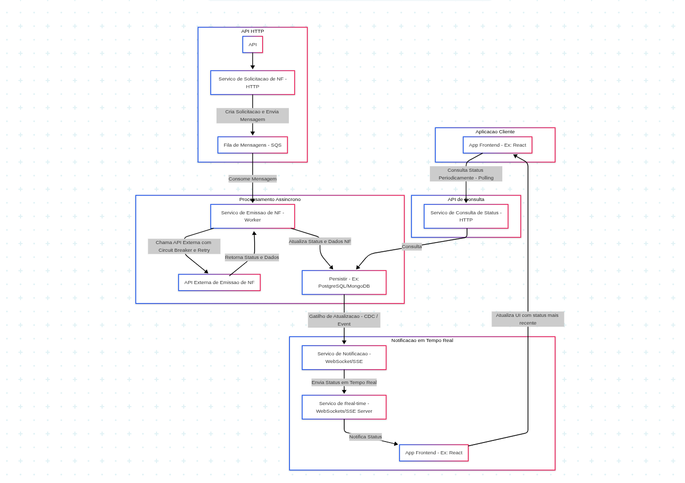

# Gestão de Solicitações de Notas Fiscais

## Solicitação de Nota Fiscal (Invoice Request):

1. Representa a intenção de emitir uma nota fiscal. Seus atributos são:

id (UUID)
cnpjTomadorServico
municipioPrestacaoServico
estadoPrestacaoServico
valorServico
dataDesejadaEmissao
descricaoServico
dataCriacao
dataUltimaAtualizacao
status (Enum: PENDENTE_EMISSAO, EMITIDA, CANCELADA)  - O status inicial deve ser PENDENTE_EMISSAO.
numeroNF
dataEmissaoNF (Data ISO, opcional - preenchido após a emissão bem-sucedida) 

2. Status da Solicitação (Invoice Status): Um Objeto de Valor (Value Object) que representa os estados possíveis da solicitação. 
3. Tomador do Serviço (Service Taker)
4. Serviço de Emissão de Nota Fiscal (Invoice Issuance Service - Domínio)
5. Tratamento de Erros e Retentativa de Emissão
Para garantir a resiliência a falhas na integração com a API externa e a eventual emissão das notas fiscais criar um "Padrão Circuit Breaker" para evitar que falhas na API externa afetem o sistema.

### Estados do Circuit Breaker:
- Closed (Fechado): As requisições são permitidas para a API externa. Se ocorrerem falhas (ex: 400, 401, 500), o - Circuit Breaker as contabiliza. Se um valor de falhas for atingido dentro de um período, ele transiciona para o estado "Open".
- Open (Aberto): Nenhuma requisição é enviada à API externa. Todas as chamadas falham instantaneamente. Após um tempo limite configurável, ele transiciona para "Half-Open".
- Half-Open (Meio-Aberto): Um número limitado de requisições de teste é permitido para a API externa. Se essas requisições forem bem-sucedidas, ele volta para o estado "Closed". Se falharem, ele retorna para o estado "Open".


## Solução para Exibir o ultimo status de um processamento.



## Estrutura do projeto

```bash
src
 ┣ application
 ┃ ┗ use-cases
 ┃ ┃ ┣ create-invoice-request
 ┃ ┃ ┃ ┣ create-invoice-request.command.ts
 ┃ ┃ ┃ ┗ create-invoice-request.handler.ts
 ┃ ┃ ┣ get-invoice-status
 ┃ ┃ ┃ ┣ get-invoice-status.handler.ts
 ┃ ┃ ┃ ┗ get-invoice-status.query.ts
 ┃ ┃ ┗ list-invoice-requests
 ┃ ┃ ┃ ┣ list-invoice-requests.handler.ts
 ┃ ┃ ┃ ┗ list-invoice-requests.query.ts
 ┣ domain
 ┃ ┣ common
 ┃ ┃ ┗ services
 ┃ ┃ ┃ ┗ invoice-issuance.service.ts
 ┃ ┣ events
 ┃ ┃ ┗ invoice-requested.event.ts
 ┃ ┗ invoice-request
 ┃ ┃ ┣ invoice-request-status.vo.ts
 ┃ ┃ ┣ invoice-request.aggregate.ts
 ┃ ┃ ┗ invoice-request.repository.ts
 ┣ infrastructure
 ┃ ┣ http-client
 ┃ ┃ ┣ circuit-breaker
 ┃ ┃ ┃ ┗ invoice-issuance.circuit-breaker.ts
 ┃ ┃ ┗ external-invoice-api.client.ts
 ┃ ┣ message-queue
 ┃ ┃ ┗ rabbitmq.client.ts
 ┃ ┗ persistence
 ┃ ┃ ┣ repositories
 ┃ ┃ ┃ ┗ invoice-request.mongo.repository.ts
 ┃ ┃ ┗ schemas
 ┃ ┃ ┃ ┗ invoice-request.schema.ts
 ┣ interfaces
 ┃ ┣ cli
 ┃ ┃ ┗ worker-runner.ts
 ┃ ┗ http
 ┃ ┃ ┣ controllers
 ┃ ┃ ┃ ┗ invoice-request.controller.ts
 ┃ ┃ ┣ dtos
 ┃ ┃ ┃ ┗ create-invoice-request.dto.ts
 ┃ ┃ ┗ routes
 ┃ ┃ ┃ ┗ invoice-request.routes.ts
 ┣ shared
 ┃ ┗ utils
 ┃ ┃ ┗ retry.util.ts
 ┗ app.ts
```